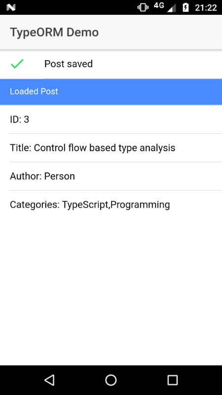

# ionic-typeorm-starter


Starter template for build Ionic/Angular/Cordova apps with Typeorm.

[](https://github.com/coturiv/ionic-typeorm-starter/actions)
[](https://renovatebot.com/)
[](https://david-dm.org/coturiv/ionic-typeorm-starter)


## Getting Started

- [Download the installer](https://nodejs.org/) for Node.js 10 or greater.
- Install the ionic CLI globally: `npm install -g ionic`
- Clone this repository: `git clone https://github.com/coturiv/ionic-typeorm-starter`.
- Run `npm install` from the project root.
- Run `ionic serve` in a terminal from the project root.


## Screenshot



## Adding TypeORM to an existing app

- Install dependencies

    ```
    npm i typerom

    ionic cordova plugin add cordova-plugin-sqlite
    ```

    Below steps are required to use `Sql.js` in the web platform.

    ```
    npm i sql.js
    ```

    And install `@angular-builders/custom-webpack`, is needed for apply custom webpack config

    ```
    npm i -D @angular-builders/custom-webpack
    ```

- Project configuration 

    - Correct `typeorm` path

        `./tsconfig.app.json`
        ```
        "types": ["node"],
        "paths": {
          "typeorm": [node_modules/typeorm/browser"]
        }
        ```
    - [SQL.js] Customize Webpack

        `./angular.json`

        Create webpack in the config(or something else you prefer) and update `angular.json`.

        _Note: `webpack.asm.js` is designed to use asm.js and `webpack.wasm.js` is designed to use WebAssembly, but `webpack.wasm.js` does't support dev environment now._

        Before:
        ```
        "build": {
          "builder": "@angular-devkit/build-angular:browser",
          "options": {

        ...

        "serve": {
          "builder": "@angular-devkit/build-angular:dev-server",
        
        ```

        After:
        ```
        "build": {
          "builder": "@angular-builders/custom-webpack:browser",
          "options": {
            "customWebpackConfig": {
              "path": "./config/webpack.asm.js"
            },

        ...

        "serve": {
          "builder": "@angular-builders/custom-webpack:dev-server",
        ```

        WebAssembly in the production:
        ```
        "configurations": {
            "production": {
              "customWebpackConfig": {
                "path": "./config/webpack.wasm.js"
              },
        ```

    - [SQL.js] Add some definitions to work `typeorm` in the browser 

        `./src/polyfills.ts`
        ```
        (window.global as any) = window;

        // global.Buffer is requred
        global.Buffer = global.Buffer || require('buffer').Buffer;

        // NodeJS.process is requred
        (window as any).process = {
            env: { DEBUG: undefined },
            browser: true
        };
        ```
- [Optional] Remove `react-ative warnings`:

    use `patch` script in the `scripts` directory

- Build

    ```
    ionic cordova platform build --prod ['ios' | 'android' | 'browser']
    ```

### References

- https://typeorm.io/
- https://github.com/kripken/sql.js/
- https://github.com/just-jeb/angular-builders/tree/master/packages/custom-webpack

